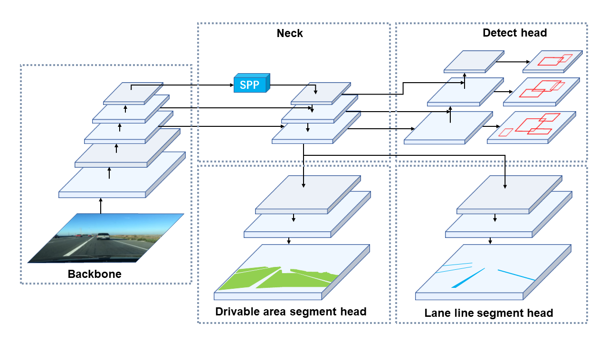
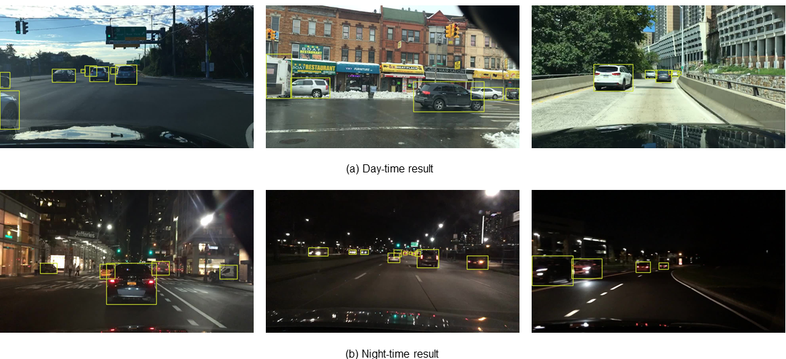
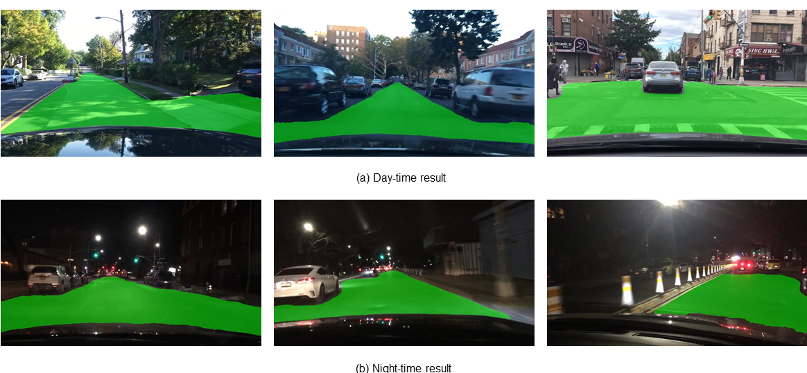
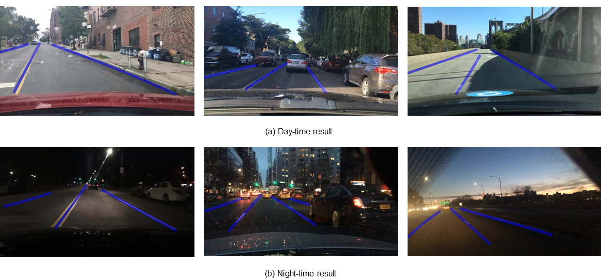

<div align="left">   

## You Only :eyes: Once for Panoptic ​ :car: Perception
> [**You Only Look at Once for Panoptic driving Perception**](https://arxiv.org/abs/2108.11250)
>
> by Dong Wu, Manwen Liao, Weitian Zhang, [Xinggang Wang](https://xinggangw.info/)<sup> :email:</sup>     [*School of EIC, HUST*](http://eic.hust.edu.cn/English/Home.htm)
>
>  (<sup>:email:</sup>) corresponding author.
>
> *arXiv technical report ([arXiv 2108.11250](https://arxiv.org/abs/2108.11250))*

---

[中文文档](https://github.com/hustvl/YOLOP/blob/main/README%20_CH.md)

### The Illustration of YOLOP



### Contributions

* We put forward an efficient multi-task network that can jointly handle three crucial tasks in autonomous driving: object detection, drivable area segmentation and lane detection to save computational costs, reduce inference time as well as improve the performance of each task. Our work is the first to reach real-time on embedded devices while maintaining state-of-the-art level performance on the `BDD100K `dataset.

* We design the ablative experiments to verify the effectiveness of our multi-tasking scheme. It is proved that the three tasks can be learned jointly without tedious alternating optimization.

  

### Results
	
[](https://paperswithcode.com/sota/traffic-object-detection-on-bdd100k?p=yolop-you-only-look-once-for-panoptic-driving)
#### Traffic Object Detection Result

| Model          | Recall(%) | mAP50(%) | Speed(fps) |
| -------------- | --------- | -------- | ---------- |
| `Multinet`     | 81.3      | 60.2     | 8.6        |
| `DLT-Net`      | 89.4      | 68.4     | 9.3        |
| `Faster R-CNN` | 77.2      | 55.6     | 5.3        |
| `YOLOv5s`      | 86.8      | 77.2     | 82         |
| `YOLOP(ours)`  | 89.2      | 76.5     | 41         |
#### Drivable Area Segmentation Result

| Model         | mIOU(%) | Speed(fps) |
| ------------- | ------- | ---------- |
| `Multinet`    | 71.6    | 8.6        |
| `DLT-Net`     | 71.3    | 9.3        |
| `PSPNet`      | 89.6    | 11.1       |
| `YOLOP(ours)` | 91.5    | 41         |

#### Lane Detection Result:

| Model         | mIOU(%) | IOU(%) |
| ------------- | ------- | ------ |
| `ENet`        | 34.12   | 14.64  |
| `SCNN`        | 35.79   | 15.84  |
| `ENet-SAD`    | 36.56   | 16.02  |
| `YOLOP(ours)` | 70.50   | 26.20  |

#### Ablation Studies 1: End-to-end v.s. Step-by-step:

| Training_method | Recall(%) | AP(%) | mIoU(%) | Accuracy(%) | IoU(%) |
| --------------- | --------- | ----- | ------- | ----------- | ------ |
| `ES-W`          | 87.0      | 75.3  | 90.4    | 66.8        | 26.2   |
| `ED-W`          | 87.3      | 76.0  | 91.6    | 71.2        | 26.1   |
| `ES-D-W`        | 87.0      | 75.1  | 91.7    | 68.6        | 27.0   |
| `ED-S-W`        | 87.5      | 76.1  | 91.6    | 68.0        | 26.8   |
| `End-to-end`    | 89.2      | 76.5  | 91.5    | 70.5        | 26.2   |

#### Ablation Studies 2: Multi-task v.s. Single task:

| Training_method | Recall(%) | AP(%) | mIoU(%) | Accuracy(%) | IoU(%) | Speed(ms/frame) |
| --------------- | --------- | ----- | ------- | ----------- | ------ | --------------- |
| `Det(only)`     | 88.2      | 76.9  | -       | -           | -      | 15.7            |
| `Da-Seg(only)`  | -         | -     | 92.0    | -           | -      | 14.8            |
| `Ll-Seg(only)`  | -         | -     | -       | 79.6        | 27.9   | 14.8            |
| `Multitask`     | 89.2      | 76.5  | 91.5    | 70.5        | 26.2   | 24.4            |

**Notes**: 

- The works we has use for reference including `Multinet`  ([paper](https://arxiv.org/pdf/1612.07695.pdf?utm_campaign=affiliate-ir-Optimise%20media%28%20South%20East%20Asia%29%20Pte.%20ltd._156_-99_national_R_all_ACQ_cpa_en&utm_content=&utm_source=%20388939),[code](https://github.com/MarvinTeichmann/MultiNet)）,`DLT-Net`   ([paper](https://ieeexplore.ieee.org/abstract/document/8937825)）,`Faster R-CNN`  ([paper](https://proceedings.neurips.cc/paper/2015/file/14bfa6bb14875e45bba028a21ed38046-Paper.pdf),[code](https://github.com/ShaoqingRen/faster_rcnn)）,`YOLOv5s`（[code](https://github.com/ultralytics/yolov5))  ,`PSPNet`([paper](https://openaccess.thecvf.com/content_cvpr_2017/papers/Zhao_Pyramid_Scene_Parsing_CVPR_2017_paper.pdf),[code](https://github.com/hszhao/PSPNet)) ,`ENet`([paper](https://arxiv.org/pdf/1606.02147.pdf),[code](https://github.com/osmr/imgclsmob))    `SCNN`([paper](https://www.aaai.org/ocs/index.php/AAAI/AAAI18/paper/download/16802/16322),[code](https://github.com/XingangPan/SCNN))    `SAD-ENet`([paper](https://openaccess.thecvf.com/content_ICCV_2019/papers/Hou_Learning_Lightweight_Lane_Detection_CNNs_by_Self_Attention_Distillation_ICCV_2019_paper.pdf),[code](https://github.com/cardwing/Codes-for-Lane-Detection)). Thanks for their wonderful works.
- In table 4, E, D, S and W refer to Encoder, Detect head, two Segment heads and whole network. So the Algorithm (First, we only train Encoder and Detect head. Then we freeze the Encoder and Detect head as well as train two Segmentation heads. Finally, the entire network is trained jointly for all three tasks.) can be marked as ED-S-W, and the same for others.

---

### Visualization

#### Traffic Object Detection Result



#### Drivable Area Segmentation Result



#### Lane Detection Result



**Notes**: 

- The visualization of lane detection result has been post processed by quadratic fitting.

---

### Project Structure

```python
├─inference
│ ├─images   # inference images
│ ├─output   # inference result
├─lib
│ ├─config/default   # configuration of training and validation
│ ├─core    
│ │ ├─activations.py   # activation function
│ │ ├─evaluate.py   # calculation of metric
│ │ ├─function.py   # training and validation of model
│ │ ├─general.py   #calculation of metric、nms、conversion of data-format、visualization
│ │ ├─loss.py   # loss function
│ │ ├─postprocess.py   # postprocess(refine da-seg and ll-seg, unrelated to paper)
│ ├─dataset
│ │ ├─AutoDriveDataset.py   # Superclass dataset，general function
│ │ ├─bdd.py   # Subclass dataset，specific function
│ │ ├─hust.py   # Subclass dataset(Campus scene, unrelated to paper)
│ │ ├─convect.py 
│ │ ├─DemoDataset.py   # demo dataset(image, video and stream)
│ ├─models
│ │ ├─YOLOP.py    # Setup and Configuration of model
│ │ ├─light.py    # Model lightweight（unrelated to paper, zwt)
│ │ ├─commom.py   # calculation module
│ ├─utils
│ │ ├─augmentations.py    # data augumentation
│ │ ├─autoanchor.py   # auto anchor(k-means)
│ │ ├─split_dataset.py  # (Campus scene, unrelated to paper)
│ │ ├─utils.py  # logging、device_select、time_measure、optimizer_select、model_save&initialize 、Distributed training
│ ├─run
│ │ ├─dataset/training time  # Visualization, logging and model_save
├─tools
│ │ ├─demo.py    # demo(folder、camera)
│ │ ├─test.py    
│ │ ├─train.py    
├─toolkits
│ │ ├─depoly    # Deployment of model
├─weights    # Pretraining model
```

---

### Requirement

This codebase has been developed with python version 3.7, PyTorch 1.7+ and torchvision 0.8+:

```
conda install pytorch==1.7.0 torchvision==0.8.0 cudatoolkit=10.2 -c pytorch
```

See `requirements.txt` for additional dependencies and version requirements.

```setup
pip install -r requirements.txt
```

### Data preparation

#### Download

- Download the images from [images](https://bdd-data.berkeley.edu/).

- Download the annotations of detection from [det_annotations](https://drive.google.com/file/d/1Ge-R8NTxG1eqd4zbryFo-1Uonuh0Nxyl/view?usp=sharing). 
- Download the annotations of drivable area segmentation from [da_seg_annotations](https://drive.google.com/file/d/1xy_DhUZRHR8yrZG3OwTQAHhYTnXn7URv/view?usp=sharing). 
- Download the annotations of lane line segmentation from [ll_seg_annotations](https://drive.google.com/file/d/1lDNTPIQj_YLNZVkksKM25CvCHuquJ8AP/view?usp=sharing). 

We recommend the dataset directory structure to be the following:

```
# The id represent the correspondence relation
├─dataset root
│ ├─images
│ │ ├─train
│ │ ├─val
│ ├─det_annotations
│ │ ├─train
│ │ ├─val
│ ├─da_seg_annotations
│ │ ├─train
│ │ ├─val
│ ├─ll_seg_annotations
│ │ ├─train
│ │ ├─val
```

Update the your dataset path in the `./lib/config/default.py`.

### Training

You can set the training configuration in the `./lib/config/default.py`. (Including:  the loading of preliminary model,  loss,  data augmentation, optimizer, warm-up and cosine annealing, auto-anchor, training epochs, batch_size).

If you want try alternating optimization or train model for single task, please modify the corresponding configuration in `./lib/config/default.py` to `True`. (As following, all configurations is `False`, which means training multiple tasks end to end).

```python
# Alternating optimization
_C.TRAIN.SEG_ONLY = False           # Only train two segmentation branchs
_C.TRAIN.DET_ONLY = False           # Only train detection branch
_C.TRAIN.ENC_SEG_ONLY = False       # Only train encoder and two segmentation branchs
_C.TRAIN.ENC_DET_ONLY = False       # Only train encoder and detection branch

# Single task 
_C.TRAIN.DRIVABLE_ONLY = False      # Only train da_segmentation task
_C.TRAIN.LANE_ONLY = False          # Only train ll_segmentation task
_C.TRAIN.DET_ONLY = False          # Only train detection task
```

Start training:

```shell
python tools/train.py
```


### Evaluation

You can set the evaluation configuration in the `./lib/config/default.py`. (Including： batch_size and threshold value for nms).

Start evaluating:

```shell
python tools/test.py --weights weights/End-to-end.pth
```


### Demo Test

We provide two testing method.

#### Folder

You can store the image or video in `--source`, and then save the reasoning result to `--save-dir`

```shell
python tools/demo --source inference/images
```


#### Camera

If there are any camera connected to your computer, you can set the `source` as the camera number(The default is 0).

```shell
python tools/demo --source 0
```


#### Demonstration

<table>
    <tr>
            <th>input</th>
            <th>output</th>
    </tr>
    <tr>
        <td></td>
        <td></td>
    </tr>
    <tr>
         <td></td>
        <td></td>
    </tr>
</table>


### Deployment

Our model can reason in real-time on `Jetson Tx2`, with `Zed Camera` to capture image. We use `TensorRT` tool for speeding up. We provide code for deployment and reasoning of model in  `./toolkits/deploy`.

#### Model Transfer

Before reasoning with TensorRT C++ API, you need to transfer the `.pth` file into binary file which can be read by C++.

```shell
python toolkits/deploy/gen_wts.py
```

After running the above command, you obtain a binary file named `yolop.wts`.

#### Running Inference

TensorRT needs an engine file for inference. Building an engine is time-consuming. It is convenient to save an engine file so that you can reuse it every time you run the inference. The process is integrated in `main.cpp`. It can determine whether to build an engine according to the existence of your engine file.

### Third Parties Resource  
* YOLOP OpenCV-DNN C++ Demo: [YOLOP-opencv-dnn](https://github.com/hpc203/YOLOP-opencv-dnn) from [hpc203](https://github.com/hpc203)  
* YOLOP ONNXRuntime C++ Demo: [lite.ai.toolkit](https://github.com/DefTruth/lite.ai/blob/main/lite/ort/cv/yolop.cpp) from [DefTruth](https://github.com/DefTruth)  
* YOLOP NCNN C++ Demo: [YOLOP-NCNN](https://github.com/EdVince/YOLOP-NCNN) from [EdVince](https://github.com/EdVince)  

## Citation

If you find our paper and code useful for your research, please consider giving a star :star:   and citation :pencil: :

```BibTeX
@misc{2108.11250,
Author = {Dong Wu and Manwen Liao and Weitian Zhang and Xinggang Wang},
Title = {YOLOP: You Only Look Once for Panoptic Driving Perception},
Year = {2021},
Eprint = {arXiv:2108.11250},
}
```

